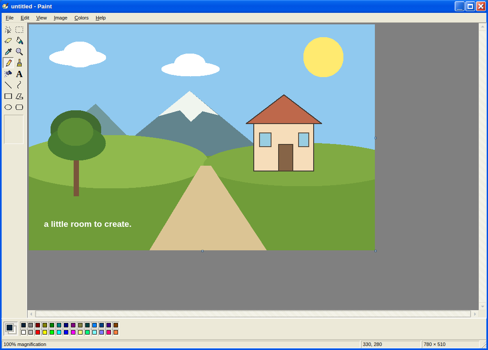

# Paint XP · WebGPU

A working, independent recreation of the Windows XP-era Paint experience in **plain HTML, CSS, and JavaScript**, with a tiled raster engine, WebGPU presentation and color compute, touch input, and a local MCP server for AI agents.

**Compatibility statement:** the goal is the XP-era layout and editing workflow. This release is **not a verified 100% pixel-identical or behavior-identical port** of a particular `mspaint.exe` build. Browser fonts, raster edges, native dialogs, printing, scanner access, and operating-system integration differ. The exact limits and adaptations are documented in [COMPATIBILITY.md](docs/COMPATIBILITY.md).



## Open in your browser

**[Launch PaintXP on GitHub Pages](https://wieslawsoltes.github.io/PaintXP/)** · [Standalone HTML](https://wieslawsoltes.github.io/PaintXP/paint-xp.html) · [Deployment workflow](https://github.com/wieslawsoltes/PaintXP/actions/workflows/pages.yml)

The hosted editor needs no installation. The Pages deployment is static: **MCP agent connections still require the local companion server and its locally served app**, not the public Pages tab. No agent token or server is published. See [deployment details](docs/DEPLOYMENT.md).

## Run

### Full application, including MCP

Requires **Node.js 20 or newer**. There are **no runtime npm dependencies**, so no `npm install` is necessary.

```sh
git clone https://github.com/wieslawsoltes/PaintXP.git
cd PaintXP
npm start
```

Or run `start.bat` on Windows / `./start.sh` on macOS or Linux. Open the **App URL printed in the terminal**. It includes a randomly generated pairing token in the URL fragment. The app removes that fragment after reading it. The server defaults to port 5173:

```text
http://127.0.0.1:5173/
```

A different port can be selected with `npm start -- --port 5174`. Save your picture before closing the tab or server.

### One-file edition

Open **`paint-xp.html`** in a browser. The complete interface, raster tools, codecs, and a Blob-based worker are embedded; no CDN, framework, or network request is required for ordinary drawing. This is the generated distribution file, not a source placeholder. The modular `index.html`, by contrast, should be served over HTTP/HTTPS.

Browser permission, file-origin, clipboard, and worker restrictions vary. For the most predictable behavior, run the local server. WebGPU requires a supporting browser and a secure context; the app checks availability at runtime and falls back to Canvas 2D. See [MDN's WebGPU documentation](https://developer.mozilla.org/en-US/docs/Web/API/WebGPU_API) and [secure-context rules](https://developer.mozilla.org/en-US/docs/Web/Security/Secure_Contexts).

**MCP requires the local companion and the app opened from that companion's origin.** Opening the one-file edition from disk or a separate static host does not make it an HTTP server and does not connect it to the companion automatically.

### Mobile and touch

Open the standalone edition in a capable browser or serve the static files over HTTPS. One finger draws; two fingers pan and pinch-zoom. **View → Touch-sized controls** enlarges the toolbox, palette, and scrollbars without replacing the XP-style interface. Leave this option off to retain desktop-sized controls. The classic menus remain menus rather than a redesigned mobile toolbar.

The companion deliberately listens only on the computer's loopback interface. It is **not a phone-accessible LAN server**. Remote/mobile MCP pairing is not included; do not change the bind address and expose the token service publicly.

## Implemented editing features

| Area | Included |
| --- | --- |
| XP-style shell | Luna title bar and window controls, six menus, 2 × 8 toolbox, contextual tool options, 28-color palette, status bar, custom Luna scrollbars, modal dialogs, Fonts and Thumbnail panels |
| All 16 tool entries | Free-form select, rectangular select, eraser/color eraser, fill, color picker, magnifier, pencil, brush, airbrush, text, line, curve, rectangle, polygon, ellipse, rounded rectangle |
| Drawing | Integer raster strokes, brush shapes and sizes, timed airbrush, outline/background-filled/solid shapes, multi-stage Bézier curve, multi-vertex polygon, left/right foreground and background colors |
| Selections | Rectangular/free-form masks, floating move and resize, opaque/background-key transparent modes, copy, cut, paste, stamp, trail, crop, delete, commit/cancel, arrow-key nudging |
| Text | Editable text box; installed font family, size, bold, italic, underline, foreground/background, wrapping, opaque or transparent background; rasterized on commit |
| Image operations | Undo/redo, clear, invert colors, black-and-white conversion, horizontal/vertical flip, 90°/180°/270° rotation, stretch/skew, scaling, canvas attributes and resize handles |
| View and input | Zoom, pixel grid, thumbnail, View Bitmap, wheel/Space/middle-button pan, keyboard shortcuts, coalesced pointer input, touch drawing and two-finger pan/zoom |
| Files | Open, drag/drop, Paste From, Copy To, Save/Save As, recent four images when browser storage is available; PNG/JPEG/WebP/BMP/GIF/baseline TIFF; see codec details below |
| Browser integration | Internal clipboard plus permission-gated system image clipboard, camera/file acquisition, browser printing and picture preview, Web Share where supported, explicit download alternatives for OS-only actions |
| AI control | Seventeen schema-validated MCP tools, image export content, live state/resources, sequential editing/batches, menu and dialog control, HTTP and stdio transports |

Use **Help → Help Topics** for interaction guidance and **Help → Rendering Diagnostics** for actual renderer, tile, history, upload, and operation counters.

## File formats

The Save As dialog offers PNG, JPEG, WebP, monochrome BMP, 16-color BMP, 256-color BMP, 24-bit BMP, GIF, and TIFF. Indexed formats reduce the palette. GIF output is a single 256-color frame, not animation. TIFF output is uncompressed RGB.

PNG/JPEG/GIF/WebP decoding uses the browser. BMP and baseline TIFF decoding are implemented locally. BMP supports uncompressed 1/4/8/16/24/32-bit data, common bitfields, and RLE4/RLE8. TIFF supports the first baseline chunky RGB/grayscale/indexed image with uncompressed, LZW, or PackBits strips and supported horizontal prediction. These are not universal decoders for every historical variant; unsupported inputs fail rather than pretend to have opened correctly. See [the format matrix](docs/COMPATIBILITY.md#file-formats).

## Connect an AI agent with MCP

Start `npm start`, open its printed App URL, then choose **Help → AI Agent Control (MCP) → Enable**. The token is prefilled when the printed URL was used. **Keep that tab open.** Merely knowing the endpoint does not enable editing: one browser tab must opt in.

### Stdio client connected to the already-running app

This option avoids accidentally starting a second server while looking at the first server's tab. For clients that use an `mcpServers` configuration object:

```json
{
  "mcpServers": {
    "paint-xp": {
      "command": "node",
      "args": ["/ABSOLUTE/PATH/paint-xp-webgpu/server/mcp-client.mjs"],
      "env": {
        "PAINT_MCP_URL": "http://127.0.0.1:5173/mcp",
        "PAINT_MCP_TOKEN": "REPLACE_WITH_TOKEN_PRINTED_BY_NPM_START"
      }
    }
  }
}
```

Replace the absolute path and token. On Windows, escape backslashes in JSON or use forward slashes. Restart/reconnect the MCP client after changing its configuration. Client-specific configuration placement differs; the file above is a template, not an automatic installation into an agent product.

### Direct HTTP

```text
Endpoint: http://127.0.0.1:5173/mcp
Authorization: Bearer YOUR_TOKEN
Transport: Streamable HTTP with JSON responses
Protocol revisions: 2025-11-25 and 2025-06-18
```

The endpoint uses POST; it does not offer an MCP GET event stream. The browser uses a **separate** authenticated SSE bridge. The local implementation follows the transport model described in the [MCP transport specification](https://modelcontextprotocol.io/specification/2025-11-25/basic/transports). It is a token-authenticated local tool, not a public OAuth service or a claim of compatibility with every MCP extension/client.

A self-hosting stdio alternative is `node server/server.mjs --stdio`. It starts its own server on an ephemeral loopback port. Open **that process's App URL from stderr** and enable its tab. stdout contains only JSON-RPC. Both configuration templates are in `examples/`.

### Agent workflow

An agent should start with `paint_get_state`, make intentional edits, and call `paint_export` with `maxDimension: 1024` to inspect the result. Coordinates are document pixels, not screen pixels. The 17 tools are:

```text
paint_get_state    paint_new          paint_set_tool    paint_set_colors
paint_stroke       paint_shape        paint_text        paint_fill
paint_selection    paint_transform    paint_edit        paint_view
paint_import       paint_export       paint_get_pixels  paint_ui
paint_batch
```

The full schemas are in `src/commands.js`; usage and safety details are in [MCP.md](docs/MCP.md). `paint_new` and replacement imports intentionally replace the document without an additional browser confirmation. Only authorize an agent you trust with the picture.

For example, these `tools/call` arguments draw an actual raster rectangle:

```json
{
  "name": "paint_shape",
  "arguments": {
    "kind": "rect", "x": 40, "y": 40, "width": 200, "height": 120,
    "color": "#000080", "background": "#ffff00",
    "fillStyle": "filled", "size": 3
  }
}
```

The same editing API is available inside the page:

```js
await paintXP.ready;
await paintXP.execute('paint_shape', {
  kind: 'ellipse', x: 40, y: 40, width: 160, height: 120,
  color: '#ff0000', fillStyle: 'solid'
});
const state = await paintXP.execute('paint_get_state');
```

`examples/draw.mjs` is a console example. `tests/demo.json` contains the real command sequence that produced the screenshot above.

## Graphics architecture and practical limits

The source of truth is a sparse map of **256 × 256 RGBA tiles**. A blank 16,384 × 16,384 document allocates no pixel tiles; a small distant stroke allocates only the tiles it touches. Undo journals changed tiles instead of copying the whole picture. The default history budget is 128 MiB, although the newest individual oversized entry is retained.

WebGPU presents visible tiles with nearest-neighbor sampling and a bounded cache. Power-of-two presentation previews reduce texture count when a huge image is zoomed out. The onscreen canvases are **viewport-sized**, not document-sized. Invert and monochrome have actual WGSL compute implementations with bounded batches and CPU readback. Flood fill and geometric transforms use a raster worker. Ordinary drawing uses deterministic CPU raster code; this is **not** a claim that every operation runs on the GPU.

Each dimension is limited to 32,768 pixels and total sparse canvas area to 268,435,456 pixels. Dense operations, including nonblank whole-canvas flood fill, dense transforms, selection extraction, import, and full-resolution export, are limited to **67,108,864 pixels**. A full-color dense image near this ceiling can still use hundreds of MiB, with additional temporary/history copies. Mobile devices may reach their practical memory limit sooner. These are guardrails, not a promise that every device handles the maximum smoothly.

A `maxDimension` preview can be exported from a larger sparse picture without creating a full-resolution canvas. The codec input limit is 256 MiB, agent input base64 is capped at 24 million characters, and agent output images are capped at 16 MiB.

## Validation and development

```sh
npm run build        # regenerate the self-contained paint-xp.html
npm test             # dependency-free Node tests
npm run benchmark    # local CPU raster benchmark; writes docs/benchmark-results.json
```

For browser checks, install Python Playwright, Pillow, and a supported Chromium separately, then run `python tests/browser_test.py`. `CHROMIUM_PATH` can select the browser executable. `PAINT_TEST_URL` can select a running HTTP app instead of the default injected standalone fixture. See [TESTING.md](docs/TESTING.md).

The delivered build passed **61 Node tests** and **55 browser checks**. The browser run exercised the **Canvas 2D fallback**, not WebGPU: managed navigation restrictions in the build environment prevented an ordinary secure localhost browser session. No uncaught desktop or emulated-mobile JavaScript errors were observed. The MCP server's HTTP/SSE bridge and stdio behavior were integration-tested with an emulated browser peer; a production external agent client was not available for certification.

**The WebGPU hardware path remains unverified in this delivery environment.** An optional live check is provided. Save the current picture first; this check deliberately replaces it:

```sh
# First: npm start, open its URL, and enable MCP in that tab.
# Set PAINT_MCP_TOKEN in your shell to the printed token, then:
npm run check:gpu -- --allow-replace
```

It refuses to claim success in fallback mode and checks GPU-computed invert/monochrome pixel values, undo, live MCP calls, and increasing GPU counters. It does not substitute for visual testing across graphics drivers.

[Recorded test results](docs/TESTING.md) and [CPU benchmark measurements](docs/benchmark-results.json) distinguish measurements from expectations. No GPU/mobile speedup is claimed from the CPU benchmark.

## Source map

```text
index.html / src/style.css      Interface and XP styling
src/app.js / ui.js / dialogs.js Editor behavior, menus, dialogs
src/scrollbars.js / icons.js    Original Luna-style controls and SVG icons
src/raster.js / worker.js       Sparse raster operations and worker
src/renderer.js                 WebGPU rendering/compute and Canvas 2D fallback
src/codecs.js                   Browser and local image codecs
src/commands.js / bridge.js     Shared MCP schemas and opt-in browser bridge
server/server.mjs              Local static server, HTTP MCP and self-hosted stdio
server/mcp-client.mjs           Stdio adapter for an existing local server
scripts/build.mjs               Dependency-free standalone build
scripts/verify-gpu.mjs          Opt-in, destructive live GPU verification
```

## License and identity

MIT-licensed project source and original assets. This is not a Microsoft product and is not affiliated with Microsoft. Microsoft/Windows/Paint names identify the intended compatibility target. No Microsoft executable, extracted icon set, or font file is bundled. Host-installed fonts are used; the included icon drawings and demonstration picture are original project assets.
